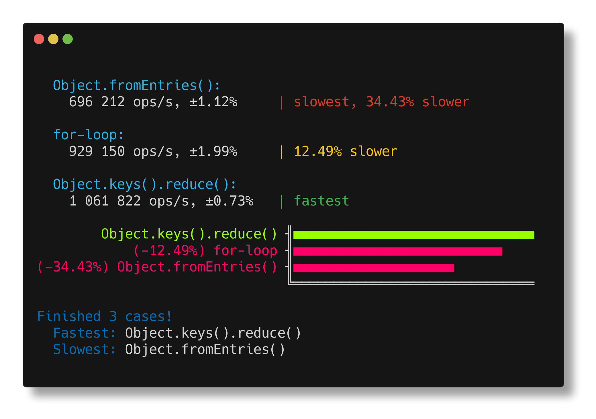
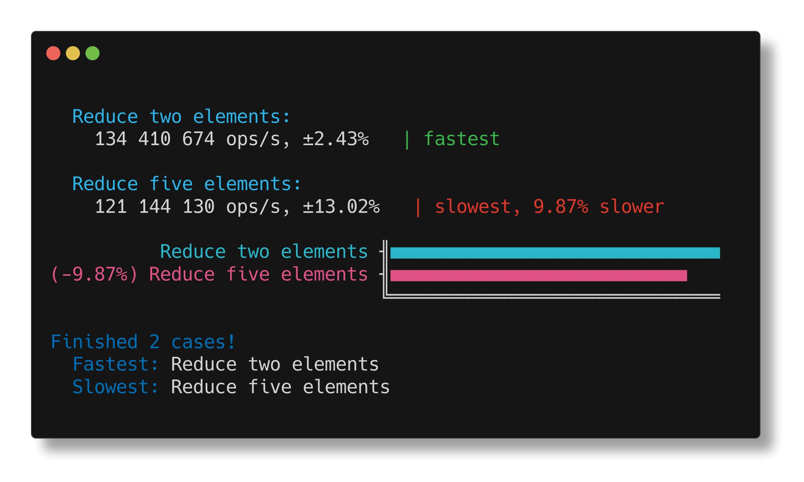

<h1 align="center">benny-ascii-chart-reporter</h1>

<p align="center">
ascii chart reporter for <a href="https://github.com/caderek/benny">benny</a> using <a href="https://github.com/tool3/chartscii">chartscii</a>
</p>



<p align="center">
   <a href="#install">        🔧 <strong>Install</strong></a>
 · <a href="#example">        🧩 <strong>Example</strong></a>
 · <a href="#api">            📜 <strong>API docs</strong></a>
 · <a href="https://github.com/stagas/benny-ascii-chart-reporter/releases"> 🔥 <strong>Releases</strong></a>
 · <a href="#contribute">     💪🏼 <strong>Contribute</strong></a>
 · <a href="#credits">        🍻 <strong>Credits</strong></a>
 · <a href="https://github.com/stagas/benny-ascii-chart-reporter/issues">   🖐️ <strong>Help</strong></a>
</p>

---

## Install

```sh
$ npm i benny-ascii-chart-reporter
```

## Example

```ts
import { suite, add, cycle, complete } from 'benny'
import { asciiChartReporter, Options } from 'benny-ascii-chart-reporter'

suite(
  __filename,

  add('Reduce two elements', () => {
    ;[1, 2].reduce((a, b) => a + b)
  }),

  add('Reduce five elements', () => {
    ;[1, 2, 3, 4, 5].reduce((a, b) => a + b)
  }),

  cycle(),

  // just pass it to complete()
  complete(
    asciiChartReporter(<Options>{
      theme: 'beach'
    })
  ),

  // complete() can be called again
  // for the default report output
  complete()
)
```

Output:



## API

<!-- Generated by documentation.js. Update this documentation by updating the source code. -->

#### Table of Contents

- [asciiChartReporter](#asciichartreporter)
  - [Parameters](#parameters)
- [summary](#summary)
  - [Parameters](#parameters-1)

### asciiChartReporter

[src/index.ts:14-43](https://github.com/stagas/benny-ascii-chart-reporter/blob/725979997110792277e33db2e4f5f5b18d337e17/src/index.ts#L14-L43 'Source code on GitHub')

Create a benny ascii chart reporter.

#### Parameters

- `options` **Options** Chartscii options (optional, default `{}`)

Returns **CompleteFn** The reporter function that can be passed to `complete()`.

### summary

[src/index.ts:21-43](https://github.com/stagas/benny-ascii-chart-reporter/blob/725979997110792277e33db2e4f5f5b18d337e17/src/index.ts#L21-L43 'Source code on GitHub')

The ascii chart reporter.

#### Parameters

- `summary` **Summary** The summary passed in the suite's `complete()` callback.

## Credits

- [benny](https://github.com/caderek/benny) - a dead simple benchmarking framework
- [chartscii](https://github.com/tool3/chartscii) - create beautiful ascii charts

## Contribute

[Fork](https://github.com/stagas/benny-ascii-chart-reporter/fork) or
[edit](https://github.dev/stagas/benny-ascii-chart-reporter) and submit a PR.

All contributions are welcome!

## License

MIT © 2021
[stagas](https://github.com/stagas)
